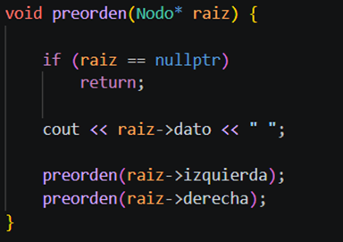
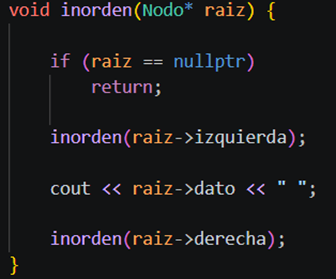

# Recorridos de Árboles Binarios - Estructura de Datos

**Universidad Técnica de Ambato**  s
**Carrera:** Ingeniería de Software  
**Asignatura:** Estructura de Datos  
**Curso:** Tercero B  
**Tema:** Recorridos de árboles binarios: Inorden, Preorden, Postorden y BFS

## Objetivo general
Implementar y analizar los principales recorridos de árboles binarios utilizando C++ y Java, aplicando estructuras de datos dinámicas, recursividad y colas.

## Resultados de aprendizaje
Al finalizar la práctica, el estudiante será capaz de:

1. Explicar la diferencia entre recorridos DFS y BFS.
2. Implementar recorridos Inorden, Preorden y Postorden con recursividad.
3. Implementar BFS usando una cola.
4. Comparar la implementación en C++ y Java.
5. Aplicar recorridos de árboles a un caso real del proyecto final.

## Contenido

| Carpeta | Descripción |
|---|---|
| `docs/` | Guía práctica para la clase |
| `src/cpp/` | Implementación completa en C++ |
| `src/java/` | Implementación completa en Java |
| `exercises/` | Ejercicios para trabajo grupal |
| `moodle/` | Banco de preguntas tipo Moodle |
| `assets/` | Recursos de apoyo |

## Reglas de recorrido

| Recorrido | Orden |
|---|---|
| Inorden | Izquierda → Raíz → Derecha |
| Preorden | Raíz → Izquierda → Derecha |
| Postorden | Izquierda → Derecha → Raíz |
| BFS | Nivel por nivel usando cola |

## Ejecución en C++

```bash
cd src/cpp
g++ main.cpp -o recorridos
./recorridos
```

## Ejecución en Java

```bash
cd src/java
javac Main.java
java Main
```

## Actividad  sugerida:

1. Clonar el repositorio.
2. Ejecutar el código base.
3. Agregar mínimo 5 nodos nuevos.
4. Mostrar los cuatro recorridos.
5. Modificar el caso de aplicación al proyecto final.
6. Subir evidencias al repositorio GitHub del grupo.

## Entregables

- Captura de ejecución en consola.
- Código fuente comentado.
- README del grupo.
- Explicación del caso real.
- Link del repositorio GitHub.

## Rúbrica breve sobre 10 puntos

| Criterio | Puntaje |
|---|---:|
| Implementación correcta de recorridos | 3 |
| Uso correcto de recursividad y cola | 2 |
| Código comentado y organizado | 1.5 |
| Aplicación al proyecto final | 2 |
| Uso de GitHub e IA documentada | 1.5 |

# Resolucion 

## Tema
Implementación de recorridos de árboles binarios utilizando:

- C++
- Java
- Recursividad
- Cola (Queue)

---

# Introducción

Los árboles binarios permiten organizar información jerárquicamente mediante nodos conectados entre sí.  
En esta práctica se implementaron los recorridos:

- Preorden
- Inorden
- Postorden
- BFS (Breadth First Search)

Se trabajó en **C++ y Java**, comparando sintaxis, estructuras dinámicas y manejo de memoria.

---
# Recorridos implementados en c++ y java 




#  Árbol base utilizado

```text
        10
       /  \
      5    15
     / \   / \
    2   7 12 20
```

---

# Ejercicio 1 — Recorridos manuales

| Recorrido | Resultado |
|---|---|
| Preorden | 10 5 2 7 15 12 20 |
| Inorden | 2 5 7 10 12 15 20 |
| Postorden | 2 7 5 12 20 15 10 |
| BFS | 10 5 15 2 7 12 20 |

---

# Ejercicio 2 — Agregar nuevos nodos

Se añadieron los nodos:

```text
1, 3, 18, 25
```

## Árbol modificado

```text
              10
            /    \
           5      15
         /  \    /  \
        2    7  12   20
       / \            / \
      1   3          18 25
```

##  Funcionalidad implementada

- Inserción manual de nodos
- Nuevos recorridos automáticos
- Expansión de niveles del árbol


---

# Ejercicio 3 — Contar nodos

Se implementó una función recursiva:

```cpp
contarNodos()
```

## Función

Recorre todo el árbol y suma cada nodo encontrado.

## Resultado


```text
Total de nodos: 11
```

---

# Ejercicio 4 — Contar hojas

Se implementó:

```cpp
contarHojas()
```

## ¿Qué hace?

Identifica nodos sin hijos.

## Hojas encontradas

```text
1, 3, 7, 12, 18, 25
```

## Resultado


```text
Total de hojas: 6
```

---

# Ejercicio 5 — Caso aplicado al proyecto final

## Sistema Web representado como árbol binario

```text
              SmartCampus UTA Web              ← Nivel 0 (raíz)
                       /                    \
          Usuarios y Acceso          Gestión de Procesos  ← Nivel 1
            /         \                 /            \
    Autenticación  Roles y Permisos  Trámites    Turnos(Cola) ← Nivel 2
      /     \         /       \       /    \      /       \
Registrar Buscar AsignarRol Consultar Registrar Historial Atender Reportes ← Nivel 3
```

---

# Aplicación de recorridos

| Funcionalidad | Recorrido | Explicación |
|---|---|---|
| Mostrar menu principal | BFS | Ideal para construir el menú de navegación porque primero muestra los módulos más generales y luego va profundizando. |
| Procesar primero los módulos internos | Postorden | Cargar primero las operaciones (Registrar, Buscar), luego el módulo que las agrupa (Autenticación), y al final el módulo raíz (Usuarios y Acceso). |
| Mostrar módulos nivel por nivel | BFS | Al recorrer nivel por nivel se puede renderizar cada nivel como una fila en el dashboard, lo que da una vista clara del organigrama. |

---

#  Uso de recursividad

La recursividad fue utilizada en:

- Preorden
- Inorden
- Postorden
- Contar nodos
- Contar hojas

## Funcionamiento

Cada función se llama a sí misma para recorrer automáticamente:

```text
Raíz → Subárbol izquierdo → Subárbol derecho
```

---

# Uso de cola (Queue)

La cola fue utilizada en el recorrido:

```text
BFS (Breadth First Search)
```

## Aplicación

Permite recorrer el árbol:

- Nivel por nivel
- De izquierda a derecha

---

# Comparación entre C++ y Java

| C++ | Java |
|---|---|
| Usa punteros | Usa objetos y referencias |
| Mayor control de memoria | Gestión automática de memoria |
| Sintaxis más técnica | Sintaxis más simple |
| Usa `->` | Usa `.` |

---

# Uso de IA como apoyo

La inteligencia artificial fue utilizada como herramienta de apoyo para comprender conceptos relacionados con:

- Árboles binarios
- Recursividad
- BFS y DFS
- Sintaxis de C++ y Java

La IA ayudó principalmente en la resolución de dudas y documentación, mientras que la implementación y adaptación de los ejercicios fue desarrollada progresivamente por el estudiante.

---

# Uso de GitHub

Durante la práctica se utilizó GitHub para:

- Control de versiones
- Registro de commits
- Seguimiento de cambios
- Recuperación de versiones anteriores
- Organización del proyecto


# Conclusiones

- Los recorridos DFS y BFS permiten recorrer árboles de distintas maneras según la necesidad.
- La recursividad simplifica el recorrido de estructuras jerárquicas.
- BFS requiere una cola para recorrer niveles correctamente.
- C++ ofrece mayor control de memoria y Java una sintaxis más sencilla.

```